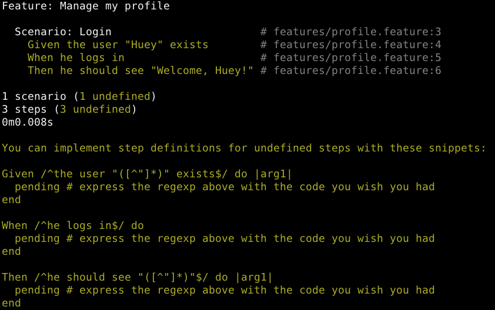
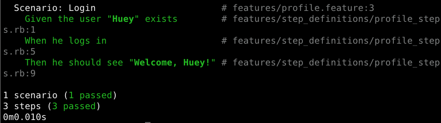

!SLIDE center transition=fade smaller

# Part 1: Cucumber & Friends

## Test-Driven Development & Beyond

!SLIDE transition=fade smaller

# Cucumber

## Behaviour-Driven Development
## Outside-In Development
## Specification By Example

!SLIDE transition=fade smaller

# The right software *matters*
## Software built right doesn't always have any value!

!SLIDE code transition=fade smaller

    @@@ cucumber
    # Specification By Example By Example
    
    # features/profile.feature
    Feature: Manage my profile

    Scenario: Login
      Given the user "Huey" exists
      When he logs in
      Then he should see "Welcome, Huey!"
      

!SLIDE code transition=fade smaller

    @@@ sh
    $ cucumber features/profile.feature

!SLIDE center

!SLIDE center

      
      
      
!SLIDE code transition=fade smaller
      
    @@@ ruby
    # Create a step definition for each undefined step
    
    # features/step_definitions/profile_steps.rb
    Given /^the user "([^"]*)" exists$/ do |name|
      @user = User.create!(:name => name)
    end
    
    When /^he logs in$/ do
      visit('/login')
      fill_in('User name', :with => @user.name)
      fill_in('Password', :with => @user.password)
      click_button('Log in')
    end
    
    ...
    
    

!SLIDE code transition=fade smaller

    @@@ sh
    # Write just enough code
    # to make the cucumbers green
    $ cucumber features/profile.feature

!SLIDE center green

# Green cukes: you're done!

!SLIDE transition=fade smaller

# Chef

## Infrastructure As Code
## DevOps
## The Cloud!

!SLIDE bullets incremental transition=fade smaller

# Automation + verifiability + reusability
## = 10 sysadmins replaced by 1 devops engineer

!SLIDE code transition=fade evensmaller

    @@@ ruby
    # first define a Chef recipe for sudo
    package "sudo" do
      action :upgrade
    end

    template "/etc/sudoers" do
      source "sudoers.erb"
      mode 0440
      owner "root"
      group "root"
      variables(
        :sudoers_groups => node['authorization']['sudo']['groups'],
        :sudoers_users => node['authorization']['sudo']['users'],
        :passwordless => node['authorization']['sudo']['passwordless']
      )
    end
    
    # then use the recipe whenever you need to manage sudo
    "authorization" => {
      "sudo" => {
        "groups" => ["admin", "wheel", "sysadmin"],
        "users" => ["jerry", "greg"],
        "passwordless" => true
      }
    }
    
    
    
!SLIDE code transition=fade evensmaller

    @@@ ruby    
    # how about configuring a firewall?
    
    # recipe omitted for the sake of brevity...
    
    # restrict port 13579 to 10.0.111.0/24 on eth0
    firewall_rule "myapplication" do  # firewall_rule is defined in the recipe
      port 13579
      source '10.0.111.0/24'
      direction 'in'
      interface 'eth0'
      action :allow
    end
    
    
    
!SLIDE transition=fade smaller

# Cucumber-Chef

## Test-Driven Infrastructure

!SLIDE code transition=fade smaller

    @@@ cucumber
    # Specify the infrastructure with cucumber
    
    # features/server.feature
    Scenario: Users can connect to server via ssh key 
      Given a newly bootstrapped server
      When the technical users recipe is applied
      Then a user should be able to ssh to the server

!SLIDE code transition=fade evensmaller

    @@@ ruby      
    # create_server, run_chef, set_run_list are defined in Cucumber-Chef      
    # features/step_definitions/server_steps.rb
    Given /^a newly bootstrapped server$/ do
      create_server("teamserver", "192.168.20.20")  
    end
    
    When /^the technical users recipe is applied$/ do   
      set_run_list('teamserver', 'recipe[users::techies]')  
      run_chef('teamserver') 
    end
    
    ...
    
    
!SLIDE

# That was a lot of material
## Let's pause for questions before we proceed