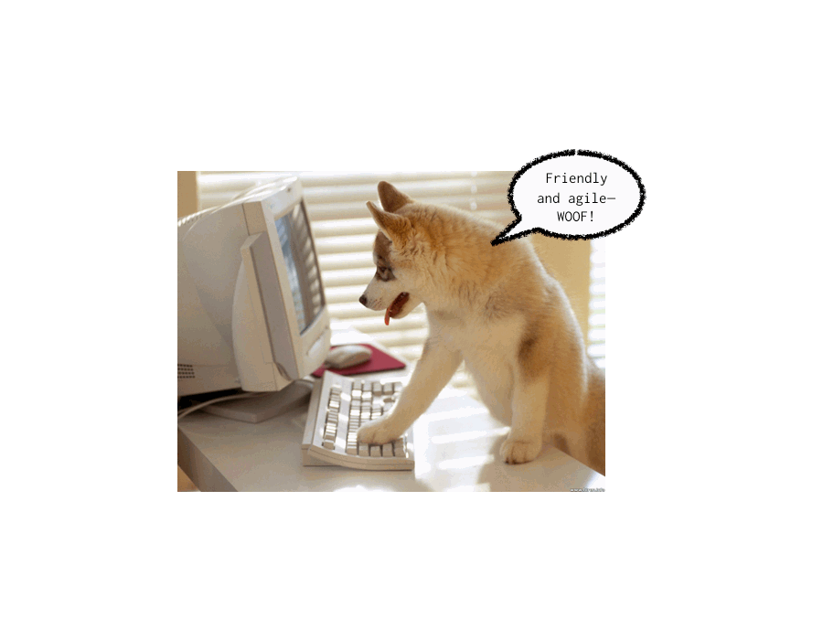

!SLIDE center

!SLIDE center

# Developer-friendly Gem Development #

# [http://sn.im/gemdev](http://sn.im/gemdev) #

!SLIDE bullets incremental transition=fade

# Mani Tadayon

* 
* [@bwsr_sr](http://twitter.com/bwsr_sr)
* github: [bowsersenior](http://github.com/bowsersenior)

!SLIDE bullets incremental transition=fade

# Gems are good

* modular
* fully-specified dependencies
* focused tests
* concise documentation

!SLIDE bullets incremental transition=fade

# Gems should be friendly

* clear documentation with examples
* no hidden gotchas
* logical names for files, modules, etc.

!SLIDE center

!SLIDE bullets incremental transition=fade

# Gems should be agile

* fast on-boarding (dependencies)
* no-fuss extensibility (organization)
* verifiable (testing)

!SLIDE center

!SLIDE bullets incremental

# Creating a gem from scratch

1. `bundle gem`
2. Enhance Bundler's barebones templates
3. Add Cucumber & RSpec
4. Write some code
5. Push to github and rubygems