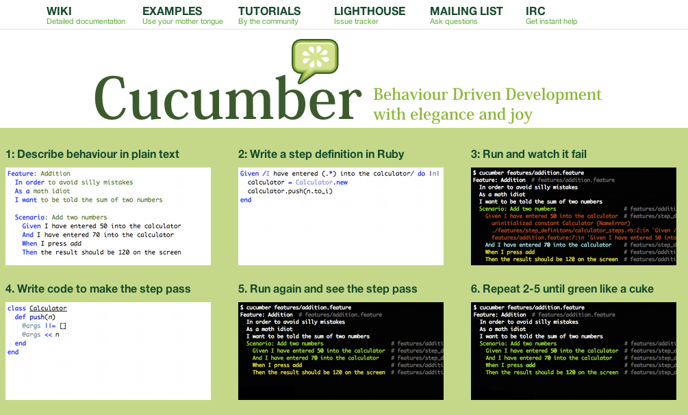
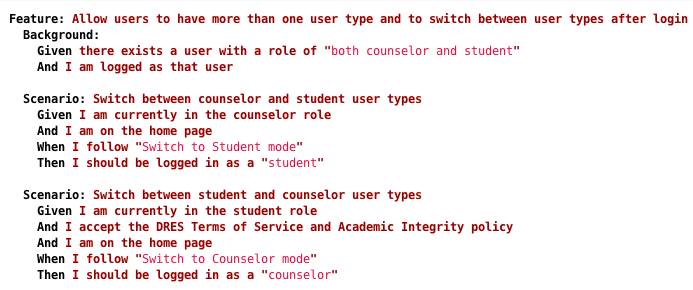

!SLIDE center transition=fadeZoom
# One more thing... #

!SLIDE bullets transition=scrollLeft
# Why Cucumber? #

* "Cucumber supports collaboration between project stakeholders and application developers, with the goal of developing a common understanding of requirements and providing a backdrop for discussion. The result of that collaboration is a set of plain-text descriptions of features..." 

from "The RSPec Book: Behaviour-Driven Development with RSPec, Cucumber, and Friends" by David Chelimsky et. al.

!SLIDE bullets transition=scrollLeft
# Why Cucumber? #

* Specifies application behavior
* Tests application functionality
* Enables detailed communications between all stakeholders

!SLIDE center transition=scrollLeft
# Cucumber uses plain English #

!SLIDE bullets transition=scrollLeft
# Cucumber is integrated with Redmine #

* Automatically updated as features are added, deleted or modified
* [From the Redmine wiki](http://studentaffairs.csun.edu/support/projects/codproctorform/wiki)
* [Direct link to cucumber features](http://studentaffairs.csun.edu/support/projects/codproctorform/wiki/Latest_Cucumber_features_specifications)